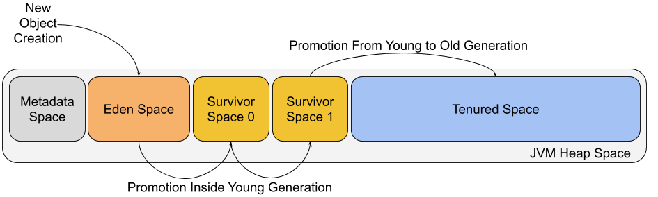

# Concurrency & Modern Java

## Garbage Collection

- Bu sekil JVM'in yaddasi nece idare etdiyini gosterir, xususile "Garbage Collcetion" arxa planda nece islediyini JVM heap space arxitekturasidir.

> JVM heap space - umumi butun yeni obyektlerin (new object()) saxlandigi yaddas sahesidir, garbage-collector esas burada istifade olunmayan obyektleri silir

> Eden space - new acar sozu ile yaradilan butun obyektler ilk olara burda goz acir, adi cennet bagi'na isaredir obyektler burada doguldugu ucun

> Survivor Space 0 & 1 - eden sahesi dolduqdan sonra minor garbage-collection sahesi ise dusur, eden'de helede sag qalan obyektler bu iki saheden birine kocurulur, ve bu saheler novberli isleyir "from-space" -> "to-space" mentiqi ile

> Tenured space - bir obyekt meselen cox heyatda qalarsa gc 15 defe sag cixarsa artiq uzun omurlu hesab olunur ve tenured space'de saxlanilir

> Meta data space - bu jvm'in bir hissesi olmasa onemli data sahesidi melumatlarin ozlerini deyil onlar haqqinda melumat dasiyi, bu sahe evvel permament generation adlanirdi

- Xulasə: Obyektin Heyat dovru
  - Obyekt Eden-də yaranır.
  - Eden dolur, GC isleyir. Obyekt sag qalırsa, Survivor Space-ə köçür.
  - Bir neçə dəfə Survivor sahələri arasında "səyahət etdikdən" sonra "yaşlanır".
  - Nəhayət, Tenured Space-ə köçürülür və orada uzun müddət yaşayır.
  - Artıq istifadə edilmədikdə isə "Major GC" tərəfindən yaddaşdan silinir.

> Garbage Collection niye vacibdir ? cunki memory leak'lerin qarsisini alir performansini artirir, outofmemory riskini azaldir

> Java'da Garbage Collection nece isleyir? Java-da GC-nin islemesinin esas prinsipi "catila bilen" (reachable) obyektlerin mueyyen edilmesidir. Bir obyekte proqramin her hansi bir aktiv hissesinden "catmaq" mumkunse, o "canli" hesab edilir. Eks halda ise "zibil" sayilir.`